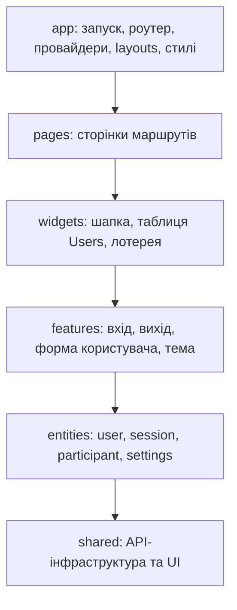

```mermaid
flowchart TD
    app[app: запуск, роутер, провайдери, layouts, стилі] --> pages[pages: сторінки маршрутів]
    pages --> widgets[widgets: шапка, таблиця Users, лотерея]
    widgets --> features[features: вхід, вихід, форма користувача, тема]
    features --> entities[entities: user, session, participant, settings]
    entities --> shared[shared: API-інфраструктура та UI]
```
